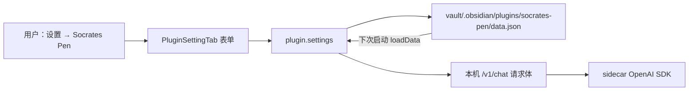

# v0.2.3 — 外人只在 Obsidian 设置页配模型

> 订正 `docs/v0.2.2-给他人用的模型配置.md`：第三人**不配环境变量**。日期：2026-08-19。
> 性质：产品约定 + 本刀实现。设置页是唯一用户入口；`.env` 只留给本仓开发回退。

---

## 订正一句话

别人不会、也不该去配 `OPENAI_API_KEY` / `OPENAI_BASE_URL` / `MODEL_NAME` / `PEN_ALLOW_ROOTS`。

用法必须像普通 Obsidian 插件：

**设置 → 第三方插件 → Socrates Pen**，在页里填 API Key、Base URL、模型名、Thinking。Sidecar URL 也在这一页（默认 `http://127.0.0.1:8765`）。库根由插件自己用 `FileSystemAdapter.getBasePath()` 带给 sidecar，用户看不见。

---

## 用户看见的 vs 磁盘上的

用户**不用开文件**。官方做法是 `PluginSettingTab` + `Setting.addText` / `addDropdown`，改一格就 `saveData()`。

Obsidian 把对象写到：

```text
<Vault>/.obsidian/plugins/socrates-pen/data.json
```

这是 `Plugin.saveData()` 的官方落点，不是给人手改的配置文件。下次启动 `loadData()` 读回来。

<details>

<summary>Obsidian 官方怎么存设置（研究摘录）</summary>

官方文档 [Settings](https://docs.obsidian.md/Plugins/User+interface/Settings) 分两步：

1. `loadData` / `saveData` 把对象落到插件目录的 `data.json`。
2. **用户还没有改设置的入口**，所以要 `this.addSettingTab(new …SettingTab(this.app, this))`，做一个设置页。

社区共识（论坛 [What goes where](https://forum.obsidian.md/t/what-goes-where-the-plugin-settings/72309)）：几乎所有插件配置都进 `data.json`，不要另开一份给人手改的导出文件。

环境变量被明确劝退。核心插件作者 pjeby（[Support env for API key management](https://forum.obsidian.md/t/support-env-for-api-key-management/94075)）：

- 插件设置页：用户好用，会随库 Sync。
- OS 环境变量：**hard for users to configure**。
- `.env` 文件：只有桌面能随便读盘、用户难创建难改，**不进前三**。

Copilot 同类 AI 插件的用户路径是：

> Settings → Copilot → Set Keys；Models (BYOK) 填 Provider / Base URL / API Key / Model ID。

没有人让用户去 export 环境变量。新版 Copilot 把钥匙放进本机 Keychain，是为了避开 Sync；第一版和绝大多数社区插件仍是设置页 + `data.json`。本刀采用后者。

</details>



<!-- 关联：v0.2.2 钥匙放哪 -->

---

## 设置页字段

| 项 | 控件 | 默认 | 说明 |
|---|---|---|---|
| API Key | 密码框 | 空 | **必须在页里填。** 不配 env 就没有别处可放。 |
| Base URL | 文本 | `https://api.deepseek.com` | OpenAI 兼容节点 |
| 模型名 | 文本 | `deepseek-v4-flash` | 节点上的 model 字符串 |
| Thinking | 下拉 off / low / medium / high | `off` | `off` 不传推理字段，最稳 |
| Sidecar URL | 文本 | `http://127.0.0.1:8765` | 本机笔的地址；一般不用改 |
| 库根 | **无控件** | 当前 vault | import 时自动带 `vault_root` |

钥匙进 `data.json` 的代价：若用户把整个库丢进 git / iCloud / Obsidian Sync，钥匙会跟着走。设置页用一句话说明。本刀不上 Keychain。

`PEN_ALLOW_ROOTS` **不再出现在用户说明书里**。插件已经知道库路径。sidecar 把请求里的 `vault_root` 记进该手册的 `allow_root`，之后 content / apply / rollback 仍认这本笔记。

---

## sidecar 合同

`ChatBody` / `ProposeBody` 增加可选覆盖：`api_key`、`base_url`、`model`、`thinking`。

`ImportBody` 增加可选 `vault_root`。

合并规则：请求体非空字段优先，缺的回退仓库根 `.env` / 进程环境。两边都没有 key → 流式 `error`，文案指向设置页，不再只喊 `.env`。

Thinking：

| 档 | sidecar |
|---|---|
| `off`（默认） | 不传 `reasoning_effort`，不加 DeepSeek `extra_body.thinking` |
| `low` / `medium` / `high` | `reasoning_effort=该档`，并附加 `extra_body={"thinking":{"type":"enabled"}}` |

不支持这些字段的节点可能 400，所以默认必须是 `off`。

`GET /v1/health` 的 `llm` 仍只反映 **sidecar 进程里的 env 回退**（不含请求体、不含 key）。插件健康行自己看设置页有没有钥匙。

---

## 开发回退（不是用户路径）

本仓自己跑 Vite / 测 sidecar 时，仍可读 `.env` 的 `DEEPSEEK_API_KEY` / `OPENAI_*`。这是开发捷径，README 和设置页都不要把它写成「请你去配环境变量」。

还剩一件和「配参数」无关的事：sidecar 进程仍要在本机跑着。那是启动问题，不是配置问题。本刀不把 Python 藏进插件。

---

## 本刀改哪些文件

- `obsidian/src/settings.ts`：设置页五件套 + 密码框 + 同步提醒。
- `obsidian/src/api.ts` / `views/PenView.ts`：每次 chat / propose / import 带覆盖和 `vault_root`。
- `pen/config.py`：`merge_llm`；`LLMConfig.thinking`。
- `pen/tutor.py`：按合并后的配置建客户端；按档传 thinking。
- `pen/sandbox.py` / `pen/libraries.py` / `pen/app.py`：`vault_root` → `allow_root`。
- `obsidian/README.md`：外人清单改成「设置页填钥匙」，删掉 PEN_ALLOW_ROOTS 必填。

不做：第二套 Anthropic/Gemini 原生 SDK、Keychain、插件一键拉起 Python、apply 真写入、社区市场上架。
